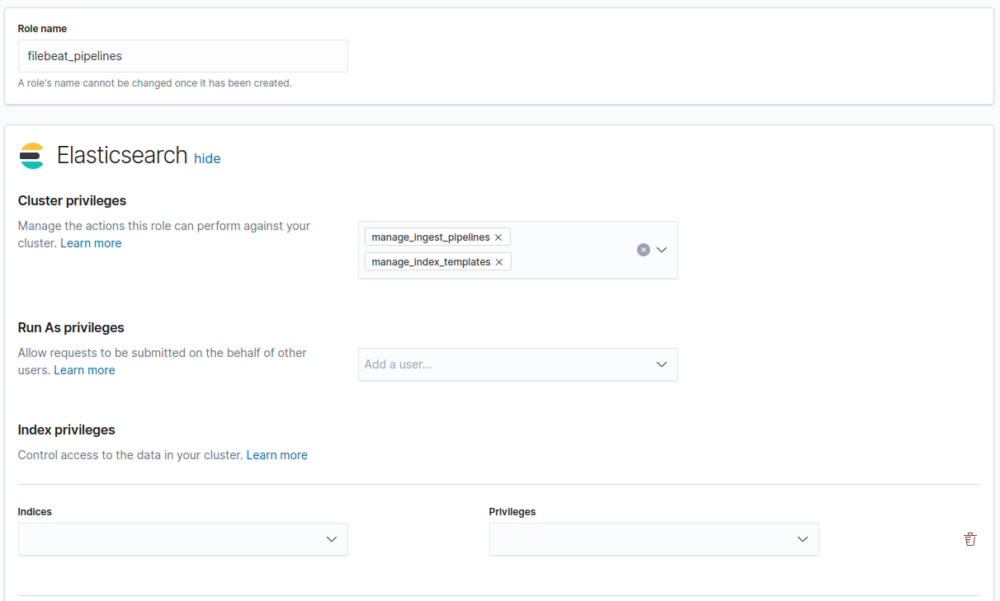

# Filebeat roles

## filebeat_monitoring

### Cluster
`monitoring`

### Indices
`create_index` on `.monitoring-beats-*`

`create_doc` on `.monitoring-beats-*`

## filebeat_pipelines

### Cluster
`manage_ingest_pipelines` `manage_index_templates`

## filebeat_setup

### Cluster
`monitor` `manage_ilm` `manage_ml`

### Indices
`manage` `write` `read` on `filebeat-*`

