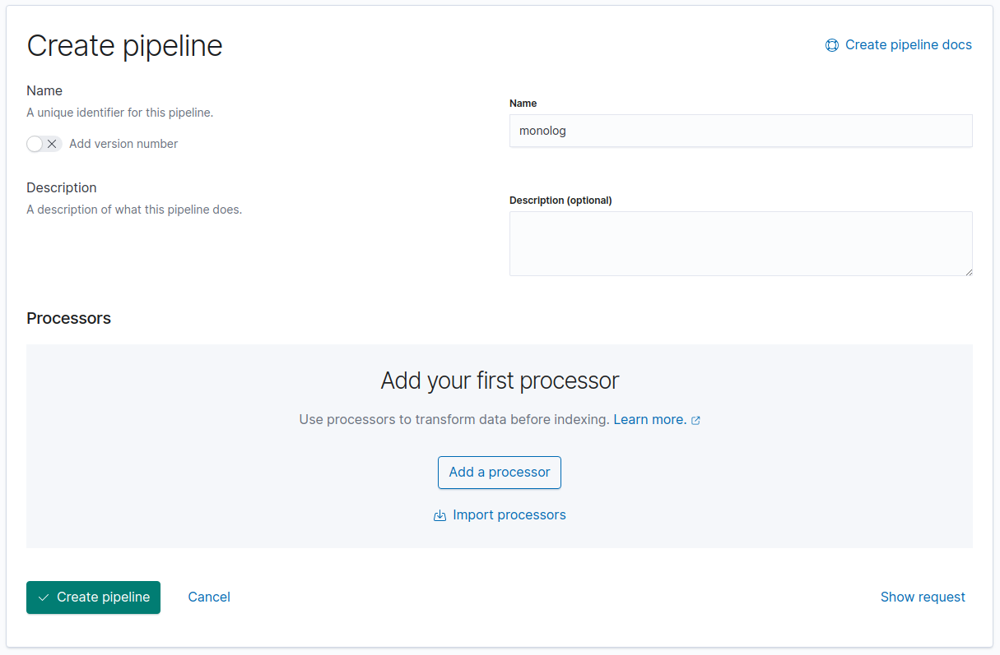
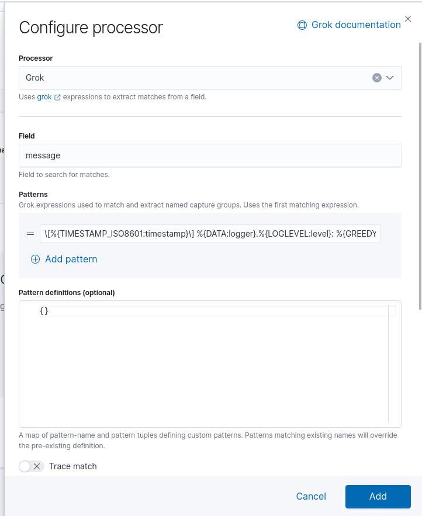

# monolog pipelines

## Create a new pipeline


## Add a `Grok` processor


#### Field `message`
#### Patterns 
```text
\[%{TIMESTAMP_ISO8601:timestamp}\] %{DATA:logger}.%{LOGLEVEL:level}: %{GREEDYDATA:message}
```
#### Ignore failure `true`
